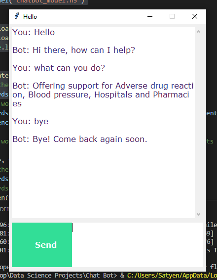

# ChatBot

## How you run the code
  
  In this project you need to following libraries with pip: 
  
  ### `pip install tensorflow, keras, pickle, nltk`
  
  To run the chatbot, we have two main files; train_chatbot.py and chatapp.py.
  
  First, we train the model using the command in the terminal:
   ### `python train_chatbot.py`
  
  If there are no errors present during training, we have successfully created the model. Then to run the app, we run the second file.
  ### `python chatgui.py`
  
  The program will open up a GUI window within a few seconds. With the GUI you can easily chat with the bot.
  
 
## Screenshots

## Citations
 DataFlair - https://data-flair.training/blogs/python-chatbot-project/

 
